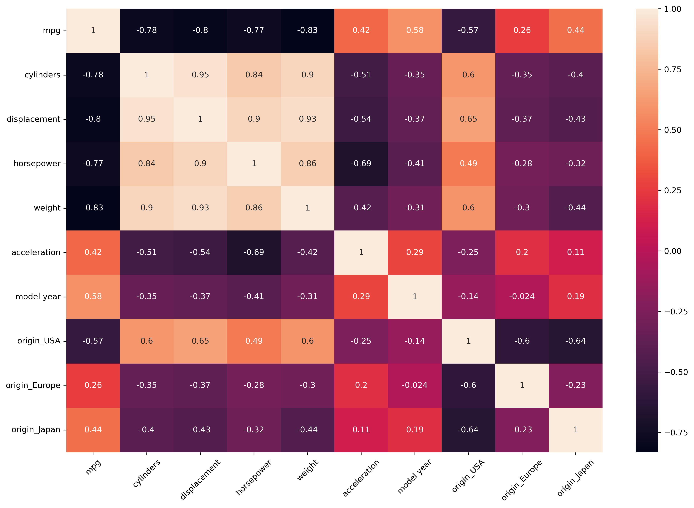
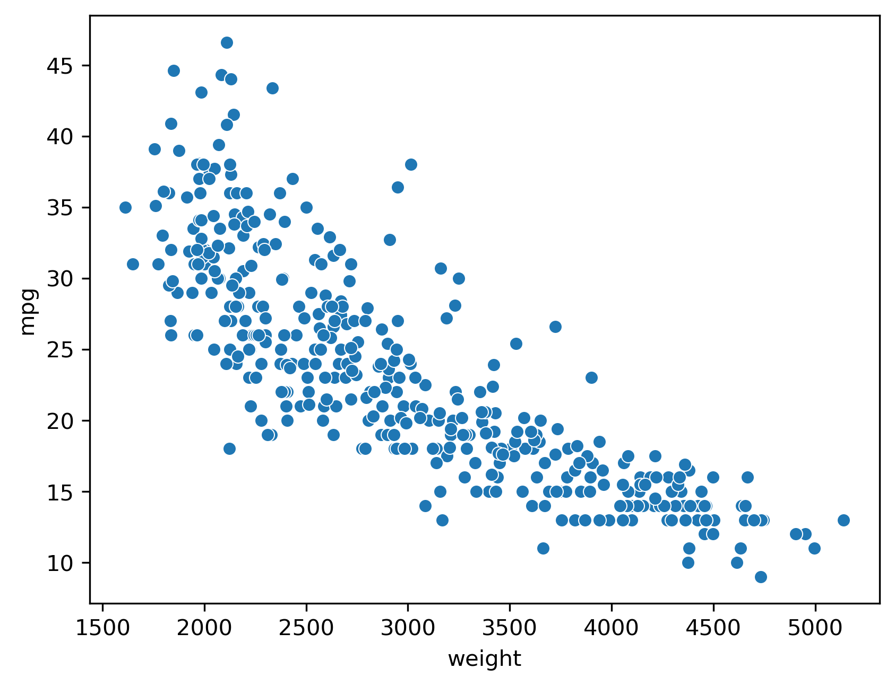

# 🚗 Auto MPG Dataset – Linear Regression Model

  

## 📌 Project Overview
This project explores the **Auto MPG dataset** to predict a car’s fuel efficiency (measured in miles per gallon – mpg).  
The main objectives are:  
- Perform **data cleaning** and **exploratory data analysis (EDA)**  
- Build and evaluate different **regression models**  
- Compare their performance using **R², Adjusted R², MAE, MSE**  
- Understand the effect of **multicollinearity** and how regularization helps  

---

## 🗂 Dataset
- Source: https://www.kaggle.com/datasets/uciml/autompg-dataset/data
- Features:  
  - cylinders, displacement, horsepower, weight, acceleration  
  - model year (1970–1982)  
  - origin (USA, Europe, Japan – one-hot encoded)  
- Target:  
  - mpg (miles per gallon – fuel efficiency)  

---

## ⚙️ Workflow
1. **Data Cleaning**
   - Replaced ? in horsepower with median value  
   - Applied one-hot encoding to origin (USA, Europe, Japan)  
   - Removed car name column  
   - Converted model year into proper year format (e.g., 70 → 1970)  
   - Standardized features using StandardScaler  

2. **EDA**
   - Correlation heatmap showed strong negative correlation of weight, displacement, horsepower, cylinders with mpg  
   - Scatter plots confirmed linear relationships (weight ↑ → mpg ↓)  
   - Multicollinearity detected among engine-related features
     
   ### Sample Visualizations
     
      

3. **Modeling**
   - Linear Regression (baseline)  
   - Ridge Regression (regularization)  
   - Lasso Regression (feature selection)  
   - Elastic Net (Ridge + Lasso balance)  

4. **Cross Validation**
   - Used RidgeCV, LassoCV, and ElasticNetCV  
   - Ensured robust performance estimation  

---

## 📊 Results

| Model            | R²      | MAE   | MSE   | Notes |
|------------------|---------|-------|-------|-------|
| **Linear**       | 0.8449  | 2.28  | 8.33  | Baseline |
| **RidgeCV**      | 0.8448  | 2.28  | 8.34  | Stable, handles multicollinearity |
| **LassoCV**      | 0.8429  | 2.28  | 8.44  | Performs feature selection |
| **ElasticNetCV** | 0.8437  | 2.28  | 8.40  | Balanced Ridge + Lasso |

---

## 📌 Key Learnings
- **Multicollinearity** between engine features affects Linear Regression coefficients.  
- **Ridge** stabilizes coefficients, **Lasso** simplifies the model by removing redundant features.
- **ElasticNet** combines *Ridge* + *Lasso* advantages.    

---

## 🚀 Next Steps
- Apply the same workflow to other datasets (Boston Housing, California Housing, Wine Quality).  
- Explore **tree-based models** (Random Forest, Gradient Boosting) for non-linear relationships.  
- Extend to hyperparameter tuning with **GridSearchCV**.  

---

✨ This project is part of my journey into Machine Learning and Regression modeling.  
